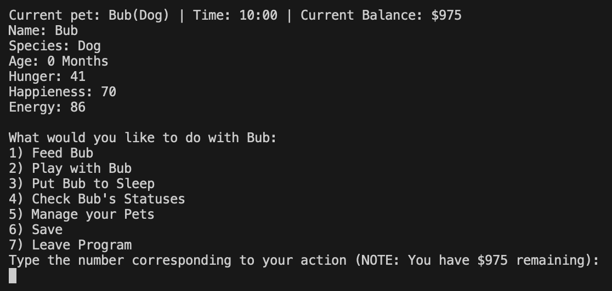

# Pet Simulator
***
This program is a simulation of caring for a pet. You will be able to care for your pet and keep it stats level while also encountering random events!

## How to Use
***
1. Go to the file named 'main.py'
2. Hit the run button (looks like YouTube triangle)
3. Follow Instructions

## Project Features
***
- Includes Class implimentation for pet creation
- Saving information for both pets and user in separate, corresponding CSVs
- You can have any kind of pet, anything from a dog to a parrot or an anglerfish!

## Contributors
- Lizzie42-SandersonFan